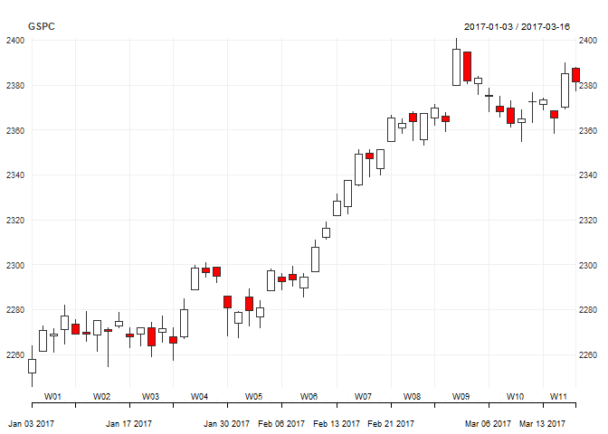

<!-- README.md is generated from README.Rmd. Please edit that file -->
[](https://cran.r-project.org/package=rd3fc)

### Install

    devtools::install_github("timelyportfolio/rd3fc")

### Example

`quantmod` is an superpower of R. Let's remember how few lines of code we need to make a static candlestick chart.

``` r
library(quantmod)

getSymbols("^GSPC", from = "2016-12-31")
#> [1] "GSPC"
chart_Series(GSPC)
```



I view this as simply amazing, but the only thing missing is some interactivity. `rd3fc` plans to eventually complete translate `chart_Series` to an interactive chart, but for now it will just produce the candlestick.

    library(rd3fc)
    # will use the current.chob() if no arguments
    chartseries()

### Code of Conduct

I would love help ad ideas, but please note that this project is released with a [Contributor Code of Conduct](CONDUCT.md). By participating in this project you agree to abide by its terms.
